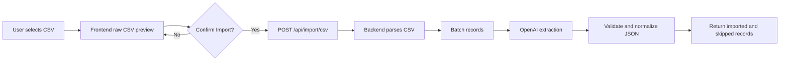

# GrowEasy AI CSV Importer

Production-style TypeScript monorepo for the GrowEasy Software Developer Intern assignment. The app lets a user upload any valid CSV, preview raw rows in the browser, and only after clicking **Confirm Import** send the original file to the backend for OpenAI-powered CRM extraction.

AI processing never runs during preview. OpenAI is called only by the backend after confirmation.

## Features

- Responsive Next.js CSV import UI.
- Browser-only raw CSV preview before import.
- Confirm Import flow that posts the original CSV to Express.
- Backend CSV parsing with preserved source row numbers.
- Batched OpenAI extraction using the existing strict prompt.
- Structured JSON validation before data reaches the frontend.
- Deterministic cleanup for emails, mobiles, dates, notes, status, and source.
- Imported and skipped record summaries.
- Stateless backend with no database.
- Sample CSV files for manual review.

## Tech Stack

| Area | Technology |
| --- | --- |
| Monorepo | pnpm workspaces |
| Frontend | Next.js, React, TypeScript, Tailwind CSS |
| Backend | Node.js, Express, TypeScript |
| Shared package | TypeScript types, constants, Zod schemas, utilities |
| AI provider | OpenAI official Node SDK |
| CSV parsing | Custom parser with quoted comma, BOM, header, and row-index handling |

## Architecture



## Local Setup

Install dependencies:

```bash
npx pnpm@latest install
```

Create environment files:

```bash
cp apps/api/.env.example apps/api/.env
cp apps/web/.env.example apps/web/.env.local
```

PowerShell:

```powershell
Copy-Item apps/api/.env.example apps/api/.env
Copy-Item apps/web/.env.example apps/web/.env.local
```

Set your backend OpenAI key in `apps/api/.env`.

## Backend Environment

`apps/api/.env`:

```env
PORT=4000
NODE_ENV=development
CORS_ORIGIN=http://localhost:3000

AI_PROVIDER=openai
OPENAI_MODEL=gpt-4.1-nano
OPENAI_API_KEY=your_openai_api_key_here
BATCH_SIZE=25
AI_MAX_RETRIES=2
MAX_FILE_SIZE_MB=5
```

Never expose `OPENAI_API_KEY` through `NEXT_PUBLIC_*` or any frontend environment variable.

## Frontend Environment

`apps/web/.env.local`:

```env
NEXT_PUBLIC_API_BASE_URL=http://localhost:4000
```

## Run Locally

```bash
npx pnpm@latest dev
```

Local URLs:

- Frontend: `http://localhost:3000`
- Backend health: `http://localhost:4000/health`

## Quality Commands

```bash
npx pnpm@latest lint
npx pnpm@latest typecheck
npx pnpm@latest build
```

## Sample CSVs

Use the files in `samples/` to manually verify preview and confirmed import:

- `samples/facebook-leads.csv`
- `samples/google-ads-leads.csv`
- `samples/real-estate-crm.csv`
- `samples/messy-manual-sheet.csv`
- `samples/invalid-records.csv`
- `samples/multiple-contacts.csv`

Manual flow:

1. Start the backend and frontend with `npx pnpm@latest dev`.
2. Open `http://localhost:3000`.
3. Upload a sample CSV.
4. Confirm the raw preview appears before import.
5. Click **Confirm Import**.
6. Review total imported, total skipped, imported records, and skipped records.

## API

### Health

```http
GET /health
```

### CSV Import

```http
POST /api/import/csv
Content-Type: multipart/form-data
```

Fields:

| Field | Required | Description |
| --- | --- | --- |
| `file` | Yes | Original CSV file. |
| `data_source` | No | Optional default source. Must be one of the allowed `data_source` values if provided. |

Success response:

```json
{
  "success": true,
  "summary": {
    "totalRows": 2,
    "totalImported": 1,
    "totalSkipped": 1,
    "totalBatches": 1,
    "failedBatches": 0
  },
  "importedRecords": [],
  "skippedRecords": []
}
```

## AI Extraction Rules

- OpenAI receives CSV rows in backend batches after Confirm Import.
- The prompt requires JSON-only output.
- Raw OpenAI output is parsed and validated before returning data.
- Rows are imported when either email or mobile exists.
- Rows are skipped only when both email and mobile are missing.
- Multiple emails: first goes to `email`, extras go to `crm_note`.
- Multiple mobiles: first goes to `mobile_without_country_code`, extras go to `crm_note`.
- Unknown fields stay as empty strings.
- Unknown `data_source` stays as `""`.

Allowed `crm_status` values:

- `GOOD_LEAD_FOLLOW_UP`
- `DID_NOT_CONNECT`
- `BAD_LEAD`
- `SALE_DONE`

Allowed `data_source` values:

- `leads_on_demand`
- `meridian_tower`
- `eden_park`
- `varah_swamy`
- `sarjapur_plots`

`data_source` may also be `""` when no allowed source is confidently present and no valid default source is provided.

## Deployment Notes

Deploy the frontend and backend separately. Configure:

Frontend:

```env
NEXT_PUBLIC_API_BASE_URL=https://your-api.example.com
```

Backend:

```env
PORT=4000
NODE_ENV=production
CORS_ORIGIN=https://your-frontend.example.com
AI_PROVIDER=openai
OPENAI_MODEL=gpt-4.1-nano
OPENAI_API_KEY=your_openai_api_key_here
BATCH_SIZE=25
AI_MAX_RETRIES=2
MAX_FILE_SIZE_MB=5
```

## Known Limitations

- Imports are stateless and are not persisted.
- Uploaded files are processed in memory and limited by `MAX_FILE_SIZE_MB`.
- The backend requires a valid OpenAI API key for confirmed imports.
