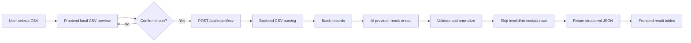

# GrowEasy AI CSV Importer

Production-style TypeScript monorepo for the GrowEasy Software Developer Intern assignment. The app lets a reviewer upload any valid CSV, preview raw rows in the browser, and only after clicking **Confirm import** send the original file to the backend for AI-assisted CRM extraction.

## Assignment Goal

Build a stateless CSV importer that can accept messy lead exports from Facebook, Google Ads, real estate CRMs, sales reports, agency sheets, and manual spreadsheets, then normalize contactable rows into the GrowEasy CRM format while skipping invalid rows.

Core rule: AI processing never runs during preview. AI starts only after **Confirm import**.

## Features

- Responsive Next.js upload workspace.
- Drag-and-drop CSV upload and file picker.
- Browser-only raw CSV preview before import.
- Virtualized raw preview table for large CSVs.
- Confirm Import flow that posts `multipart/form-data` to Express.
- Progress UI for upload, parsing, AI mapping, validation, and completion.
- Retry button for failed import requests.
- Structured result view with imported CRM records, skipped records, counts, success rate, and JSON copy/export.
- Dark mode toggle.
- Mock AI provider for local development and tests.
- Backend AI batching with retry support.
- Stateless backend, no database required.
- Backend Dockerfile for containerized demos.

## Tech Stack

| Area | Technology |
| --- | --- |
| Monorepo | pnpm workspaces |
| Frontend | Next.js, React, TypeScript, Tailwind CSS |
| Backend | Node.js, Express, TypeScript |
| Shared package | TypeScript types, constants, Zod schemas, utilities |
| CSV parsing | Custom parser with quoted comma, BOM, header, and row-index handling |
| AI adapter | Mock provider plus Gemini provider adapter |
| Tests | Vitest, TypeScript checks, ESLint |

## Architecture



## Repository Structure

```text
apps/
  web/       Next.js frontend
  api/       Express backend
packages/
  shared/    CRM constants, schemas, types, utilities
docs/        Brief, API contract, AI spec, edge cases, task plan
samples/     Demo CSV files
```

## Local Setup

Prerequisites:

- Node.js 22 recommended
- pnpm 11 recommended

Install pnpm if needed:

```bash
npm install -g pnpm
```

Install dependencies:

```bash
pnpm install
```

Copy environment files:

```bash
cp apps/api/.env.example apps/api/.env
cp apps/web/.env.example apps/web/.env.local
```

Windows PowerShell:

```powershell
Copy-Item apps/api/.env.example apps/api/.env
Copy-Item apps/web/.env.example apps/web/.env.local
```

## Environment Variables

### Backend: `apps/api/.env`

| Variable | Default | Notes |
| --- | --- | --- |
| `NODE_ENV` | `development` | Runtime mode. |
| `PORT` | `4000` | API port. |
| `CORS_ORIGIN` | `http://localhost:3000` | Allowed frontend origin. |
| `JSON_BODY_LIMIT` | `1mb` | Express JSON body limit. |
| `LOG_REQUESTS` | `true` | Request logging toggle. |
| `MAX_CSV_FILE_SIZE_BYTES` | `5242880` | Upload size limit, 5 MB by default. |
| `AI_PROVIDER` | `mock` | Use `mock` for local review or `gemini` for the real Gemini adapter. `openai` and `claude` remain placeholders. |
| `AI_BATCH_SIZE` | `25` | Rows per AI batch. |
| `AI_BATCH_RETRY_LIMIT` | `1` | Retries for failed AI batches. |
| `AI_REQUEST_TIMEOUT_MS` | `30000` | Timeout for real provider requests. |
| `AI_API_KEY` | empty | Backend-only secret. Can be used for Gemini. Never expose through `NEXT_PUBLIC_*`. |
| `GEMINI_API_KEY` | empty | Optional Gemini-specific backend secret. Used when `AI_API_KEY` is empty. |
| `GEMINI_MODEL` | `gemini-2.0-flash` | Gemini model used by the backend adapter. |

### Frontend: `apps/web/.env.local`

| Variable | Default | Notes |
| --- | --- | --- |
| `NEXT_PUBLIC_API_BASE_URL` | `http://localhost:4000` | Public backend URL used by the browser. |

## Run The App

Start frontend and backend together:

```bash
pnpm dev
```

The dev script builds `packages/shared` first so a clean checkout works.

Run separately:

```bash
pnpm dev:web
pnpm dev:api
```

Local URLs:

- Frontend: `http://localhost:3000`
- Backend health: `http://localhost:4000/health`

## Run Tests And Quality Gates

```bash
pnpm lint
pnpm typecheck
pnpm test
pnpm build
```

Coverage focuses on:

- Shared schemas and enum validation.
- CSV parsing edge cases.
- Email extraction and phone normalization.
- Skip logic for missing contact details.
- Batch splitting and AI retry behavior.
- Mock AI provider.
- API route success and invalid upload cases.
- Frontend CSV preview and API response guards.

## Sample CSVs

Use these files to test preview and confirmed import in mock mode:

- `samples/facebook-leads.csv`
- `samples/google-ads-leads.csv`
- `samples/real-estate-crm.csv`
- `samples/messy-manual-sheet.csv`
- `samples/invalid-records.csv`
- `samples/multiple-contacts.csv`

Demo flow:

1. Keep `AI_PROVIDER=mock` in `apps/api/.env`.
2. Run `pnpm dev`.
3. Open `http://localhost:3000`.
4. Upload a sample CSV.
5. Inspect the raw preview.
6. Click **Confirm import**.
7. Review imported records, skipped records, totals, success rate, and JSON export.

## API Documentation

### Health

```http
GET /health
```

Returns:

```json
{
  "status": "ok"
}
```

### CSV Import

```http
POST /api/import/csv
Content-Type: multipart/form-data
```

Fields:

| Field | Required | Description |
| --- | --- | --- |
| `file` | Yes | Original CSV file. |
| `data_source` | No | Optional default source. Must be one of the allowed `data_source` values. |

Success response:

```json
{
  "success": true,
  "summary": {
    "totalRows": 2,
    "totalImported": 1,
    "totalSkipped": 1,
    "totalBatches": 1,
    "failedBatches": 0
  },
  "importedRecords": [],
  "skippedRecords": []
}
```

Common error response:

```json
{
  "error": {
    "code": "INVALID_FILE",
    "message": "A valid CSV file is required."
  }
}
```

See [docs/API_CONTRACT.md](docs/API_CONTRACT.md) for the full contract.

## AI Extraction Approach

- Frontend preview parses CSV locally and does not call the backend or AI.
- Confirm Import sends the original CSV file to the backend.
- Backend parses CSV rows and preserves source row numbers.
- Rows are sent to the AI provider in batches.
- `AI_PROVIDER=mock` works without any API key for local review.
- `AI_PROVIDER=gemini` calls Gemini from the backend only, using `AI_API_KEY` or `GEMINI_API_KEY`.
- Gemini requests send the existing system and user prompt and request JSON output with `responseMimeType: application/json`.
- `openai` and `claude` remain clean placeholders for future adapters.
- AI output must be strict JSON.
- Backend validates AI output against shared schemas before returning it.
- Deterministic post-processing enforces contact rules and enum safety.

Allowed `crm_status` values:

- `GOOD_LEAD_FOLLOW_UP`
- `DID_NOT_CONNECT`
- `BAD_LEAD`
- `SALE_DONE`

Allowed `data_source` values:

- `leads_on_demand`
- `meridian_tower`
- `eden_park`
- `varah_swamy`
- `sarjapur_plots`

`data_source` may also be `""` when no allowed source is confidently present and no valid default source is provided.

## Validation And Skipped Records

Imported records must include:

```text
created_at
name
email
country_code
mobile_without_country_code
company
city
state
country
lead_owner
crm_status
crm_note
data_source
possession_time
description
```

Skip rules:

- Skip rows with neither email nor mobile number.
- Skip empty rows.
- Skip rows that cannot pass final schema validation.
- If multiple emails exist, use the first email and put the rest in `crm_note`.
- If multiple mobiles exist, use the first mobile and put the rest in `crm_note`.
- Leave `data_source`, `created_at`, and `lead_owner` as empty strings when they cannot be extracted from the CSV or a valid request default.
- Preserve `source_row` so reviewers can trace skipped rows to the CSV.

## Backend Docker

Build from the repository root:

```bash
docker build -f apps/api/Dockerfile -t groweasy-ai-csv-api .
```

Run in mock mode:

```bash
docker run --rm -p 4000:4000 \
  -e CORS_ORIGIN=http://localhost:3000 \
  -e AI_PROVIDER=mock \
  groweasy-ai-csv-api
```

PowerShell:

```powershell
docker run --rm -p 4000:4000 `
  -e CORS_ORIGIN=http://localhost:3000 `
  -e AI_PROVIDER=mock `
  groweasy-ai-csv-api
```

## Deployment Guide

Suggested split deployment:

- Frontend: Vercel, Netlify, or any Next.js host.
- Backend: Render, Railway, Fly.io, ECS, or a Docker-capable Node host.

Frontend environment:

```text
NEXT_PUBLIC_API_BASE_URL=https://your-api.example.com
```

Backend environment:

```text
NODE_ENV=production
PORT=4000
CORS_ORIGIN=https://your-frontend.example.com
AI_PROVIDER=mock
AI_BATCH_SIZE=25
AI_BATCH_RETRY_LIMIT=1
AI_REQUEST_TIMEOUT_MS=30000
AI_API_KEY=
GEMINI_API_KEY=
GEMINI_MODEL=gemini-2.0-flash
```

Gemini mode:

```text
AI_PROVIDER=gemini
GEMINI_API_KEY=<your-gemini-api-key>
GEMINI_MODEL=gemini-2.0-flash
```

Deployment placeholders:

- Frontend URL: `https://<frontend-deployment-url>`
- Backend URL: `https://<backend-deployment-url>`
- API health: `https://<backend-deployment-url>/health`

## Screenshots

Add final screenshots before submission:

- Upload and raw preview: `docs/screenshots/upload-preview.png`
- Import progress: `docs/screenshots/import-progress.png`
- Imported/skipped results: `docs/screenshots/import-results.png`
- Dark mode: `docs/screenshots/dark-mode.png`

## Known Limitations

- Gemini is implemented through a backend-only REST adapter. OpenAI and Claude remain placeholders.
- No authentication is included because it is outside assignment scope.
- No database is used; imports are stateless and not persisted.
- Uploaded files are processed in memory and should stay within the configured size limit.
- CSV preview is optimized for review, not spreadsheet editing.

## Bonus Features Implemented

- Drag-and-drop upload.
- Import progress indicators.
- Retry failed import request.
- Backend AI batch retry.
- Virtualized CSV preview table.
- Dark mode toggle.
- Unit and route tests.
- Backend Dockerfile.
- Sample CSV suite.
- Submission-focused README and documentation.

## Reviewer Checklist

- Start with `AI_PROVIDER=mock`.
- Run `pnpm install`.
- Run `pnpm dev`.
- Upload a sample CSV.
- Confirm that raw preview appears before import.
- Click **Confirm import**.
- Confirm imported and skipped records are displayed.
- Run `pnpm lint`, `pnpm typecheck`, `pnpm test`, and `pnpm build`.
